# Plan V2: Migracion Firebase a Supabase con Normalizacion Controlada

## Contexto

MovieTime usa Firebase Auth y Firestore con un modelo NoSQL desnormalizado. Ese modelo redujo lecturas, pero introdujo complejidad operativa:

- contadores manuales con `increment()`;
- campos duplicados como `clienteNombre`, `categoriaNombre`, `metodoPagoNombre`;
- arrays embebidos en `categorias`;
- propagacion manual cuando cambian entidades padre;
- servicios de sincronizacion en cascada;
- riesgo de drift entre ventas, servicios, usuarios, pagos y categorias.

La migracion a Supabase/PostgreSQL debe aprovechar el modelo relacional para que la base de datos sea la fuente de verdad:

- JOINs reemplazan campos duplicados;
- tablas normalizadas reemplazan arrays embebidos;
- triggers protegen invariantes;
- views reemplazan read models derivados;
- RLS reemplaza reglas Firestore;
- Edge Functions reemplazan procesos batch ejecutados desde el cliente.

El objetivo no es solo cambiar Firebase por Supabase. El objetivo es simplificar el dominio, preservar historial y reducir codigo accidental.

## Decisiones Arquitectonicas

### IDs

Los IDs de Firestore se preservan como `TEXT` en tablas de dominio:

```text
usuarios.id
servicios.id
ventas.id
venta_periodos.id
pagos_venta.id
servicio_periodos.id
pagos_servicio.id
metodos_pago.id
categorias.id
planes_tipos.id
planes.id
gastos.id
templates.id
notificaciones.id
activity_log.id
```

Supabase Auth mantiene `UUID`:

```text
auth.users.id
profiles.id
```

Esto evita tabla `_id_map`, reduce riesgo del migrador y encaja con los tipos actuales de TypeScript, donde los IDs son `string`.

### Naming

Base de datos usa `snake_case`. TypeScript mantiene `camelCase`.

Debe existir una capa de mapping:

```text
src/lib/supabase/client.ts
src/lib/supabase/auth.ts
src/lib/supabase/queries.ts
src/lib/supabase/mappers.ts
src/lib/supabase/pagination.ts
src/lib/supabase/database.types.ts
```

Los nombres SQL no deben esparcirse directamente por toda la UI.

### Dinero y Monedas

Todo hecho financiero conserva el valor original, la moneda original, el valor en USD y la tasa usada:

```sql
monto_original NUMERIC(12,2) NOT NULL
moneda_original TEXT NOT NULL DEFAULT 'USD'
monto_usd NUMERIC(16,4) NOT NULL
exchange_rate NUMERIC(20,8)
```

Para costos de servicio y ventas se usan nombres equivalentes:

```text
total_original / total_usd
costo_original / costo_usd
```

Regla:

- `monto_original`, `total_original` o `costo_original`: valor registrado por el usuario.
- `moneda_original`: moneda en ese momento.
- `*_usd`: valor normalizado para dashboard y reportes.
- `exchange_rate`: tasa usada al crear o migrar el registro.

No se mantiene `exchange_rate_history`. La tasa historica importante queda guardada directamente en pagos, gastos y periodos.

### Ventas y Servicios

La separacion central del modelo es:

```text
ventas -> venta_periodos -> pagos_venta
servicios -> servicio_periodos -> pagos_servicio
```

Esto separa tres hechos:

- la relacion/asignacion;
- el periodo cubierto;
- el movimiento financiero.

Regla importante: un periodo puede tener uno o varios pagos registrados. No se impone `un periodo = un pago`, porque eso impediria pagos divididos, pagos parciales o correcciones futuras. El estado financiero del periodo se calcula por suma de pagos registrados.

### Notificaciones

Las notificaciones se modelan de forma normalizada con tabla base y tablas especificas:

```text
notificaciones
notificaciones_venta
notificaciones_servicio
notificaciones_reposo
```

No se usa `payload JSONB` como fuente principal porque el objetivo es mantener un schema normalizado y validable.

### Campos Eliminados

Se eliminan del modelo y del sistema actual:

```text
categorias.icon_url
categorias.color
```

Motivo: no son usados por el flujo actual. En el codigo actual se removieron `iconUrl` y `color` de `Categoria`, el dialog legacy que los capturaba y los renders residuales.

Tambien se elimina:

```text
config_dias_notificacion
exchange_rate_history
```

Motivo:

- el sistema debe mostrar vencimientos dentro de una ventana continua de proximos 7 dias, no dias exactos configurados;
- el historial de tasa ya queda preservado en cada hecho financiero.

## Parte 0: Limpieza Previa en Firebase

Estas acciones se hacen en Firebase antes de exportar.

### 0.1 Purgar `VentaDoc.pagos[]`

`src/types/ventas.ts` marca `pagos` como deprecated. La fuente real debe ser `pagosVenta`.

Script one-shot:

1. Leer todas las ventas.
2. Detectar ventas con `pagos[]`.
3. Para cada pago embebido, verificar equivalente en `pagosVenta`.
4. Generar reporte JSON.
5. Borrar el campo solo si la verificacion pasa:

```ts
updateDoc(ref, { pagos: deleteField() })
```

Criterio de salida:

```text
0 ventas con pagos[] deprecated
0 pagos embebidos sin equivalente en pagosVenta
```

### 0.2 Ejecutar Global Sync

Ejecutar desde UI admin:

```ts
centralSyncService.performGlobalSync()
```

Debe reportar cero correcciones en:

```text
resyncContadoresCategorias
resyncServiciosActivos
resyncPerfilesDisponiblesTotal
```

Si hay correcciones, ejecutar de nuevo y exportar solo cuando el segundo resultado sea cero.

### 0.3 Greps Confirmatorios

```bash
rg "clientesStore|revendedoresStore" src
rg "adjustVentasActivas" src
rg "adjustServiciosActivos|adjustCategoriaGastos|updatePerfilOcupado" src
rg "syncServicioDependencias|syncUsuarioMetodoPago|syncMetodoPagoDependencias" src
rg "serviciosActivos|perfilesOcupados|ingresosTotales|gastosTotal|ventasTotales" src
```

Estas llamadas no viven solo en stores. Tambien aparecen en componentes de ventas, notificaciones, reposo y detalle de servicio.

### 0.4 Moneda Historica

Para gastos historicos existentes:

```text
monto_original = monto actual
moneda_original = USD
monto_usd = monto actual
exchange_rate = 1
```

## Parte 1: Schema PostgreSQL Normalizado

### Extensiones

```sql
CREATE EXTENSION IF NOT EXISTS pgcrypto;
CREATE EXTENSION IF NOT EXISTS pg_trgm;
```

### Enums

```sql
CREATE TYPE ciclo_pago_enum AS ENUM ('mensual','trimestral','semestral','anual');
CREATE TYPE usuario_tipo_enum AS ENUM ('cliente','revendedor');
CREATE TYPE categoria_tipo_enum AS ENUM ('cliente','revendedor','ambos');
CREATE TYPE categoria_tipo_cat_enum AS ENUM ('plataforma_streaming','otros');
CREATE TYPE metodo_pago_tipo_enum AS ENUM ('banco','yappy','paypal','binance','efectivo');
CREATE TYPE tipo_cuenta_enum AS ENUM ('ahorro','corriente','wallet','telefono','email');
CREATE TYPE asociado_a_enum AS ENUM ('usuario','servicio');
CREATE TYPE venta_estado_enum AS ENUM ('activo','inactivo');
CREATE TYPE periodo_tipo_enum AS ENUM ('inicial','renovacion','ajuste');
CREATE TYPE pago_estado_enum AS ENUM ('registrado','anulado','reembolsado');
CREATE TYPE notificacion_prioridad_enum AS ENUM ('baja','media','alta','critica');
CREATE TYPE notificacion_entidad_enum AS ENUM ('venta','servicio','reposo');
CREATE TYPE accion_log_enum AS ENUM ('creacion','actualizacion','eliminacion','renovacion');
CREATE TYPE entidad_log_enum AS ENUM (
  'cliente','revendedor','servicio','usuario',
  'categoria','metodo_pago','gasto','venta','template'
);
CREATE TYPE tipo_template_enum AS ENUM (
  'notificacion_regular','dia_pago','renovacion','suscripcion','cancelacion'
);
```

### `profiles`

```sql
CREATE TABLE profiles (
  id UUID PRIMARY KEY REFERENCES auth.users(id) ON DELETE CASCADE,
  display_name TEXT NOT NULL DEFAULT '',
  role TEXT NOT NULL DEFAULT 'operador' CHECK (role IN ('admin','operador')),
  active BOOLEAN NOT NULL DEFAULT true,
  created_at TIMESTAMPTZ NOT NULL DEFAULT now(),
  updated_at TIMESTAMPTZ NOT NULL DEFAULT now()
);
```

### `currencies`

```sql
CREATE TABLE currencies (
  code TEXT PRIMARY KEY,
  nombre TEXT,
  activo BOOLEAN NOT NULL DEFAULT true
);
```

### `exchange_rates`

Tabla de tasa actual/cache. No conserva historial porque cada registro financiero guarda la tasa usada.

```sql
CREATE TABLE exchange_rates (
  currency_pair TEXT PRIMARY KEY,
  rate NUMERIC(20,8) NOT NULL,
  last_updated TIMESTAMPTZ NOT NULL DEFAULT now(),
  source TEXT NOT NULL DEFAULT 'open.er-api.com'
);
```

### `metodos_pago`

```sql
CREATE TABLE metodos_pago (
  id TEXT PRIMARY KEY DEFAULT gen_random_uuid()::text,
  nombre TEXT NOT NULL,
  tipo metodo_pago_tipo_enum NOT NULL,
  banco TEXT,
  pais TEXT NOT NULL DEFAULT 'PA',
  moneda TEXT NOT NULL REFERENCES currencies(code),
  titular TEXT NOT NULL,
  tipo_cuenta tipo_cuenta_enum,
  identificador TEXT NOT NULL,
  alias TEXT,
  notas TEXT,
  activo BOOLEAN NOT NULL DEFAULT true,
  asociado_a asociado_a_enum,
  email TEXT,
  contrasena TEXT,
  numero_tarjeta TEXT,
  fecha_expiracion TEXT,
  created_at TIMESTAMPTZ NOT NULL DEFAULT now(),
  updated_at TIMESTAMPTZ NOT NULL DEFAULT now(),
  created_by UUID REFERENCES profiles(id)
);
```

### `categorias`

Sin arrays embebidos, sin counters, sin `icon_url`, sin `color`.

```sql
CREATE TABLE categorias (
  id TEXT PRIMARY KEY DEFAULT gen_random_uuid()::text,
  nombre TEXT NOT NULL,
  tipo categoria_tipo_enum NOT NULL,
  tipo_categoria categoria_tipo_cat_enum,
  notas TEXT,
  activo BOOLEAN NOT NULL DEFAULT true,
  created_at TIMESTAMPTZ NOT NULL DEFAULT now(),
  updated_at TIMESTAMPTZ NOT NULL DEFAULT now(),
  created_by UUID REFERENCES profiles(id)
);
```

### `planes_tipos`

Extraido de `Categoria.tiposPlanes[]`.

```sql
CREATE TABLE planes_tipos (
  id TEXT PRIMARY KEY DEFAULT gen_random_uuid()::text,
  categoria_id TEXT NOT NULL REFERENCES categorias(id),
  nombre TEXT NOT NULL,
  orden INTEGER,
  activo BOOLEAN NOT NULL DEFAULT true,
  created_at TIMESTAMPTZ NOT NULL DEFAULT now(),
  updated_at TIMESTAMPTZ NOT NULL DEFAULT now(),
  UNIQUE (categoria_id, nombre),
  UNIQUE (id, categoria_id)
);
```

### `planes`

Extraido de `Categoria.planes[]`.

```sql
CREATE TABLE planes (
  id TEXT PRIMARY KEY DEFAULT gen_random_uuid()::text,
  categoria_id TEXT NOT NULL REFERENCES categorias(id),
  plan_tipo_id TEXT NOT NULL,
  nombre TEXT NOT NULL,
  precio NUMERIC(12,2) NOT NULL CHECK (precio >= 0),
  ciclo_pago ciclo_pago_enum NOT NULL,
  orden INTEGER,
  activo BOOLEAN NOT NULL DEFAULT true,
  created_at TIMESTAMPTZ NOT NULL DEFAULT now(),
  updated_at TIMESTAMPTZ NOT NULL DEFAULT now(),
  UNIQUE (categoria_id, plan_tipo_id, nombre),
  FOREIGN KEY (plan_tipo_id, categoria_id)
    REFERENCES planes_tipos(id, categoria_id)
);
```

`planes.precio` es precio actual. El historial comercial vive en `venta_periodos`.

### `usuarios`

Sin `metodoPagoNombre`, sin `moneda`, sin `serviciosActivos`.

```sql
CREATE TABLE usuarios (
  id TEXT PRIMARY KEY DEFAULT gen_random_uuid()::text,
  nombre TEXT NOT NULL,
  apellido TEXT NOT NULL,
  tipo usuario_tipo_enum NOT NULL,
  telefono TEXT NOT NULL,
  email TEXT,
  metodo_pago_id TEXT REFERENCES metodos_pago(id) ON DELETE SET NULL,
  active BOOLEAN NOT NULL DEFAULT true,
  notas TEXT,
  created_at TIMESTAMPTZ NOT NULL DEFAULT now(),
  updated_at TIMESTAMPTZ NOT NULL DEFAULT now(),
  created_by UUID REFERENCES profiles(id)
);
```

### `servicios`

Representa la cuenta/recurso que MovieTime administra. No es la fuente historica de costos.

```sql
CREATE TABLE servicios (
  id TEXT PRIMARY KEY DEFAULT gen_random_uuid()::text,
  categoria_id TEXT NOT NULL REFERENCES categorias(id),
  plan_tipo_id TEXT,
  nombre TEXT NOT NULL,
  correo TEXT NOT NULL,
  contrasena TEXT NOT NULL,
  perfiles_disponibles INTEGER NOT NULL DEFAULT 0 CHECK (perfiles_disponibles >= 0),
  perfiles_ocupados INTEGER NOT NULL DEFAULT 0 CHECK (perfiles_ocupados >= 0),
  activo BOOLEAN NOT NULL DEFAULT true,
  en_reposo BOOLEAN NOT NULL DEFAULT false,
  dias_reposo INTEGER CHECK (dias_reposo BETWEEN 1 AND 35),
  fecha_inicio_reposo DATE,
  fecha_fin_reposo DATE,
  cortado_at TIMESTAMPTZ,
  cortado_by UUID REFERENCES profiles(id),
  motivo_corte TEXT,
  archivado_at TIMESTAMPTZ,
  archivado_by UUID REFERENCES profiles(id),
  motivo_archivado TEXT,
  notas TEXT,
  created_at TIMESTAMPTZ NOT NULL DEFAULT now(),
  updated_at TIMESTAMPTZ NOT NULL DEFAULT now(),
  created_by UUID REFERENCES profiles(id),
  CHECK (perfiles_ocupados <= perfiles_disponibles),
  FOREIGN KEY (plan_tipo_id, categoria_id)
    REFERENCES planes_tipos(id, categoria_id)
);
```

### `servicio_periodos`

Representa cada compra o renovacion del servicio.

```sql
CREATE TABLE servicio_periodos (
  id TEXT PRIMARY KEY DEFAULT gen_random_uuid()::text,
  servicio_id TEXT NOT NULL REFERENCES servicios(id),
  numero_periodo INTEGER NOT NULL,
  tipo periodo_tipo_enum NOT NULL,
  fecha_inicio DATE NOT NULL,
  fecha_vencimiento DATE NOT NULL,
  ciclo_pago ciclo_pago_enum NOT NULL,
  costo_original NUMERIC(12,2) NOT NULL,
  moneda_original TEXT NOT NULL REFERENCES currencies(code),
  costo_usd NUMERIC(16,4) NOT NULL,
  exchange_rate NUMERIC(20,8),
  renovacion_automatica BOOLEAN NOT NULL DEFAULT false,
  created_at TIMESTAMPTZ NOT NULL DEFAULT now(),
  created_by UUID REFERENCES profiles(id),
  UNIQUE (servicio_id, numero_periodo),
  CHECK (fecha_vencimiento >= fecha_inicio)
);
```

### `pagos_servicio`

Representa el pago real que MovieTime hizo al proveedor.

```sql
CREATE TABLE pagos_servicio (
  id TEXT PRIMARY KEY DEFAULT gen_random_uuid()::text,
  servicio_periodo_id TEXT NOT NULL REFERENCES servicio_periodos(id),
  servicio_id TEXT NOT NULL REFERENCES servicios(id),
  fecha_pago TIMESTAMPTZ NOT NULL DEFAULT now(),
  estado pago_estado_enum NOT NULL DEFAULT 'registrado',
  monto_original NUMERIC(12,2) NOT NULL,
  moneda_original TEXT NOT NULL REFERENCES currencies(code),
  monto_usd NUMERIC(16,4) NOT NULL,
  exchange_rate NUMERIC(20,8),
  metodo_pago_id TEXT REFERENCES metodos_pago(id) ON DELETE SET NULL,
  metodo_pago_nombre_snapshot TEXT,
  notas TEXT,
  created_at TIMESTAMPTZ NOT NULL DEFAULT now(),
  created_by UUID REFERENCES profiles(id),
  anulada_at TIMESTAMPTZ,
  anulada_by UUID REFERENCES profiles(id),
  motivo_anulacion TEXT
);
```

### `ventas`

Representa la asignacion del cliente a un servicio/perfil. No es la fuente historica de precios o vencimientos.

```sql
CREATE TABLE ventas (
  id TEXT PRIMARY KEY DEFAULT gen_random_uuid()::text,
  cliente_id TEXT REFERENCES usuarios(id) ON DELETE SET NULL,
  servicio_id TEXT NOT NULL REFERENCES servicios(id),
  categoria_id TEXT NOT NULL REFERENCES categorias(id),
  estado venta_estado_enum NOT NULL DEFAULT 'activo',
  perfil_numero INTEGER,
  perfil_nombre TEXT,
  codigo TEXT,
  cortada_at TIMESTAMPTZ,
  cortada_by UUID REFERENCES profiles(id),
  motivo_corte TEXT,
  archivado_at TIMESTAMPTZ,
  archivado_by UUID REFERENCES profiles(id),
  motivo_archivado TEXT,
  notas TEXT,
  created_at TIMESTAMPTZ NOT NULL DEFAULT now(),
  updated_at TIMESTAMPTZ NOT NULL DEFAULT now(),
  created_by UUID REFERENCES profiles(id)
);

CREATE UNIQUE INDEX idx_ventas_servicio_perfil_activo
ON ventas(servicio_id, perfil_numero)
WHERE estado = 'activo'
  AND perfil_numero IS NOT NULL
  AND archivado_at IS NULL;
```

Regla de negocio:

- si el cliente renueva antes del corte, se agrega `venta_periodos`;
- si el cliente fue cortado y vuelve dos meses despues, se crea una venta nueva;
- reabrir una venta vieja solo debe ser accion admin auditada para corregir errores.
- eliminar una venta desde UI no cambia `estado`; marca `archivado_at` para ocultarla de listados normales.

### `venta_periodos`

Representa cada periodo vendido o renovado.

```sql
CREATE TABLE venta_periodos (
  id TEXT PRIMARY KEY DEFAULT gen_random_uuid()::text,
  venta_id TEXT NOT NULL REFERENCES ventas(id),
  numero_periodo INTEGER NOT NULL,
  tipo periodo_tipo_enum NOT NULL,
  fecha_inicio DATE NOT NULL,
  fecha_fin DATE NOT NULL,
  ciclo_pago ciclo_pago_enum NOT NULL,
  plan_id TEXT REFERENCES planes(id) ON DELETE SET NULL,
  plan_nombre_snapshot TEXT,
  plan_tipo_nombre_snapshot TEXT,
  precio_original NUMERIC(12,2) NOT NULL,
  descuento NUMERIC(5,2) NOT NULL DEFAULT 0 CHECK (descuento >= 0 AND descuento <= 100),
  total_original NUMERIC(12,2) NOT NULL,
  moneda_original TEXT NOT NULL REFERENCES currencies(code),
  total_usd NUMERIC(16,4) NOT NULL,
  exchange_rate NUMERIC(20,8),
  created_at TIMESTAMPTZ NOT NULL DEFAULT now(),
  created_by UUID REFERENCES profiles(id),
  UNIQUE (venta_id, numero_periodo),
  CHECK (fecha_fin >= fecha_inicio)
);
```

### `pagos_venta`

Representa el cobro real del cliente.

```sql
CREATE TABLE pagos_venta (
  id TEXT PRIMARY KEY DEFAULT gen_random_uuid()::text,
  venta_periodo_id TEXT NOT NULL REFERENCES venta_periodos(id),
  venta_id TEXT NOT NULL REFERENCES ventas(id),
  fecha_pago TIMESTAMPTZ NOT NULL DEFAULT now(),
  estado pago_estado_enum NOT NULL DEFAULT 'registrado',
  monto_original NUMERIC(12,2) NOT NULL,
  moneda_original TEXT NOT NULL REFERENCES currencies(code),
  monto_usd NUMERIC(16,4) NOT NULL,
  exchange_rate NUMERIC(20,8),
  metodo_pago_id TEXT REFERENCES metodos_pago(id) ON DELETE SET NULL,
  metodo_pago_nombre_snapshot TEXT,
  notas TEXT,
  created_at TIMESTAMPTZ NOT NULL DEFAULT now(),
  created_by UUID REFERENCES profiles(id),
  anulada_at TIMESTAMPTZ,
  anulada_by UUID REFERENCES profiles(id),
  motivo_anulacion TEXT
);
```

### `tipos_gasto`

```sql
CREATE TABLE tipos_gasto (
  id TEXT PRIMARY KEY DEFAULT gen_random_uuid()::text,
  nombre TEXT NOT NULL UNIQUE,
  descripcion TEXT,
  activo BOOLEAN NOT NULL DEFAULT true,
  created_at TIMESTAMPTZ NOT NULL DEFAULT now(),
  updated_at TIMESTAMPTZ NOT NULL DEFAULT now()
);
```

### `gastos`

Sin `tipoGastoNombre`.

```sql
CREATE TABLE gastos (
  id TEXT PRIMARY KEY DEFAULT gen_random_uuid()::text,
  tipo_gasto_id TEXT NOT NULL REFERENCES tipos_gasto(id),
  fecha DATE NOT NULL,
  monto_original NUMERIC(12,2) NOT NULL,
  moneda_original TEXT NOT NULL REFERENCES currencies(code),
  monto_usd NUMERIC(16,4) NOT NULL,
  exchange_rate NUMERIC(20,8),
  detalle TEXT,
  created_at TIMESTAMPTZ NOT NULL DEFAULT now(),
  updated_at TIMESTAMPTZ NOT NULL DEFAULT now(),
  created_by UUID REFERENCES profiles(id)
);
```

### Notificaciones Normalizadas

Tabla base:

```sql
CREATE TABLE notificaciones (
  id TEXT PRIMARY KEY DEFAULT gen_random_uuid()::text,
  dedupe_key TEXT UNIQUE NOT NULL,
  entidad notificacion_entidad_enum NOT NULL,
  tipo TEXT NOT NULL,
  prioridad notificacion_prioridad_enum NOT NULL,
  titulo TEXT NOT NULL,
  mensaje TEXT,
  dias_restantes INTEGER,
  scheduled_for DATE,
  leida BOOLEAN NOT NULL DEFAULT false,
  resaltada BOOLEAN NOT NULL DEFAULT false,
  created_at TIMESTAMPTZ NOT NULL DEFAULT now(),
  updated_at TIMESTAMPTZ NOT NULL DEFAULT now(),
  read_at TIMESTAMPTZ,
  dismissed_at TIMESTAMPTZ
);
```

Datos especificos de ventas:

```sql
CREATE TABLE notificaciones_venta (
  notificacion_id TEXT PRIMARY KEY REFERENCES notificaciones(id) ON DELETE CASCADE,
  venta_id TEXT NOT NULL REFERENCES ventas(id),
  venta_periodo_id TEXT REFERENCES venta_periodos(id) ON DELETE SET NULL,
  cliente_id TEXT REFERENCES usuarios(id) ON DELETE SET NULL,
  servicio_id TEXT REFERENCES servicios(id) ON DELETE SET NULL,
  categoria_id TEXT REFERENCES categorias(id) ON DELETE SET NULL,
  cliente_nombre_snapshot TEXT NOT NULL,
  cliente_telefono_snapshot TEXT,
  servicio_nombre_snapshot TEXT NOT NULL,
  servicio_correo_snapshot TEXT,
  servicio_contrasena_snapshot TEXT,
  categoria_nombre_snapshot TEXT,
  perfil_nombre_snapshot TEXT,
  codigo_snapshot TEXT,
  fecha_inicio_snapshot DATE,
  fecha_fin_snapshot DATE,
  ciclo_pago_snapshot ciclo_pago_enum,
  precio_final_snapshot NUMERIC(12,2),
  moneda_snapshot TEXT,
  metodo_pago_nombre_snapshot TEXT
);
```

Datos especificos de servicios:

```sql
CREATE TABLE notificaciones_servicio (
  notificacion_id TEXT PRIMARY KEY REFERENCES notificaciones(id) ON DELETE CASCADE,
  servicio_id TEXT NOT NULL REFERENCES servicios(id),
  servicio_periodo_id TEXT REFERENCES servicio_periodos(id) ON DELETE SET NULL,
  categoria_id TEXT REFERENCES categorias(id) ON DELETE SET NULL,
  servicio_nombre_snapshot TEXT NOT NULL,
  servicio_correo_snapshot TEXT,
  servicio_contrasena_snapshot TEXT,
  categoria_nombre_snapshot TEXT,
  fecha_inicio_snapshot DATE,
  fecha_vencimiento_snapshot DATE,
  ciclo_pago_snapshot ciclo_pago_enum,
  costo_servicio_snapshot NUMERIC(12,2),
  moneda_snapshot TEXT,
  metodo_pago_nombre_snapshot TEXT,
  renovacion_automatica_snapshot BOOLEAN
);
```

Datos especificos de reposo:

```sql
CREATE TABLE notificaciones_reposo (
  notificacion_id TEXT PRIMARY KEY REFERENCES notificaciones(id) ON DELETE CASCADE,
  servicio_id TEXT NOT NULL REFERENCES servicios(id),
  categoria_id TEXT REFERENCES categorias(id) ON DELETE SET NULL,
  servicio_nombre_snapshot TEXT NOT NULL,
  servicio_correo_snapshot TEXT,
  servicio_contrasena_snapshot TEXT,
  categoria_nombre_snapshot TEXT,
  dias_reposo_snapshot INTEGER,
  fecha_inicio_reposo_snapshot DATE,
  fecha_fin_reposo_snapshot DATE
);
```

### `activity_log`

```sql
CREATE TABLE activity_log (
  id TEXT PRIMARY KEY DEFAULT gen_random_uuid()::text,
  usuario_id UUID REFERENCES profiles(id) ON DELETE SET NULL,
  usuario_email TEXT NOT NULL,
  accion accion_log_enum NOT NULL,
  entidad entidad_log_enum NOT NULL,
  entidad_id TEXT NOT NULL,
  entidad_nombre TEXT NOT NULL,
  detalles TEXT NOT NULL,
  cambios JSONB,
  timestamp TIMESTAMPTZ NOT NULL DEFAULT now()
);
```

`activity_log.cambios` puede ser JSONB porque es auditoria descriptiva, no fuente operacional normalizada.

### `templates` y `template_placeholders`

```sql
CREATE TABLE templates (
  id TEXT PRIMARY KEY DEFAULT gen_random_uuid()::text,
  nombre TEXT NOT NULL,
  tipo tipo_template_enum NOT NULL,
  contenido TEXT NOT NULL,
  activo BOOLEAN NOT NULL DEFAULT true,
  created_at TIMESTAMPTZ NOT NULL DEFAULT now(),
  updated_at TIMESTAMPTZ NOT NULL DEFAULT now()
);

CREATE TABLE template_placeholders (
  id TEXT PRIMARY KEY DEFAULT gen_random_uuid()::text,
  template_id TEXT NOT NULL REFERENCES templates(id) ON DELETE CASCADE,
  placeholder TEXT NOT NULL,
  UNIQUE (template_id, placeholder)
);
```

### `config`

Sin `config_dias_notificacion`.

La app muestra vencimientos dentro de una ventana continua de proximos 7 dias:

```sql
CREATE TABLE config (
  id TEXT PRIMARY KEY DEFAULT 'global',
  notificaciones_dias_anticipacion INTEGER NOT NULL DEFAULT 7
    CHECK (notificaciones_dias_anticipacion BETWEEN 1 AND 60),
  hora_envio INTEGER NOT NULL DEFAULT 9
    CHECK (hora_envio BETWEEN 0 AND 23),
  whatsapp_prefijo TEXT NOT NULL DEFAULT '+507',
  updated_at TIMESTAMPTZ NOT NULL DEFAULT now()
);

INSERT INTO config (id) VALUES ('global') ON CONFLICT DO NOTHING;
```

Uso esperado:

```sql
WHERE fecha_vencimiento >= CURRENT_DATE
  AND fecha_vencimiento <= CURRENT_DATE + (notificaciones_dias_anticipacion || ' days')::interval
```

### `dashboard_stats`

Puede mantenerse como cache regenerable, no como fuente de verdad.

```sql
CREATE TABLE dashboard_stats (
  id TEXT PRIMARY KEY DEFAULT 'singleton',
  gastos_total NUMERIC(16,4) NOT NULL DEFAULT 0,
  ingresos_total NUMERIC(16,4) NOT NULL DEFAULT 0,
  usuarios_por_mes JSONB NOT NULL DEFAULT '[]',
  usuarios_por_dia JSONB NOT NULL DEFAULT '[]',
  ingresos_por_mes JSONB NOT NULL DEFAULT '[]',
  ingresos_por_dia JSONB NOT NULL DEFAULT '[]',
  ingresos_por_categoria JSONB NOT NULL DEFAULT '[]',
  ingresos_categorias_por_mes JSONB NOT NULL DEFAULT '[]',
  ventas_pronostico JSONB NOT NULL DEFAULT '[]',
  servicios_pronostico JSONB NOT NULL DEFAULT '[]',
  updated_at TIMESTAMPTZ NOT NULL DEFAULT now()
);

INSERT INTO dashboard_stats (id) VALUES ('singleton') ON CONFLICT DO NOTHING;
```

La fuente de verdad sigue siendo:

```text
ventas
venta_periodos
pagos_venta
servicios
servicio_periodos
pagos_servicio
gastos
usuarios
categorias
```

Decision V1:

```text
Mantener dashboard_stats como cache regenerable para reducir cambios de UI durante la migracion.
```

Decision V2 recomendada:

```text
Reemplazar dashboard_stats por views/materialized views.
```

Ejemplo:

```sql
CREATE MATERIALIZED VIEW mv_dashboard_ingresos_mensuales AS
SELECT
  date_trunc('month', pv.fecha_pago) AS mes,
  SUM(pv.monto_usd) AS ingresos_usd
FROM pagos_venta pv
WHERE pv.estado = 'registrado'
GROUP BY 1;
```

Si se mantiene `dashboard_stats`, la regeneracion debe usar lock transaccional para evitar race conditions.

### `legacy_orphan_records`

Tabla de preservacion para documentos huerfanos detectados durante la migracion desde Firestore. No forma parte del flujo operacional normal.

```sql
CREATE TABLE legacy_orphan_records (
  id TEXT PRIMARY KEY DEFAULT gen_random_uuid()::text,
  source_collection TEXT NOT NULL,
  source_id TEXT NOT NULL,
  orphan_reason TEXT NOT NULL,
  payload JSONB NOT NULL,
  detected_at TIMESTAMPTZ NOT NULL DEFAULT now(),
  resolved_at TIMESTAMPTZ,
  resolution TEXT,
  UNIQUE (source_collection, source_id)
);
```

Ejemplos de uso:

```text
pagosVenta con ventaId inexistente
pagosServicio con servicioId inexistente
ventas con servicioId inexistente
servicios con categoriaId inexistente
```

## Parte 1.5: Reglas SQL que Deben Respetar las Migrations

Esta seccion convierte las decisiones del plan en una checklist concreta para crear migrations. El objetivo es que las migrations no dependan de interpretacion.

### Orden minimo de migrations

Las migrations deben separarse para poder validar y revertir por bloques:

```text
000_extensions.sql
001_enums.sql
002_core_tables.sql
003_financial_tables.sql
004_notification_tables.sql
005_indexes.sql
006_triggers.sql
007_views.sql
008_rls.sql
009_seed_data.sql
010_validation_functions.sql
```

Reglas:

- enums antes de tablas;
- tablas padre antes de tablas hija;
- indexes despues de tablas;
- triggers despues de tablas e indices base;
- views despues de tablas/triggers;
- RLS al final, cuando ya existan tablas, views y funciones helper;
- seed data despues de `currencies`, `config` y `profiles` base.

### Seed data obligatorio

Debe existir seed minimo:

```sql
INSERT INTO currencies (code, nombre, activo)
VALUES
  ('USD', 'US Dollar', true),
  ('PAB', 'Balboa', true),
  ('ARS', 'Peso argentino', true),
  ('TRY', 'Lira turca', true)
ON CONFLICT (code) DO NOTHING;

INSERT INTO config (id)
VALUES ('global')
ON CONFLICT DO NOTHING;
```

La lista de monedas puede ampliarse segun datos reales del export. El migrador debe fallar si encuentra una moneda que no existe en `currencies`.

### Matriz de FK y `ON DELETE`

Esta matriz manda sobre cualquier `ON DELETE` ambiguo en el DDL.

| Tabla hija | FK | Politica | Razon |
|---|---|---|---|
| `profiles` | `id -> auth.users.id` | `ON DELETE CASCADE` | El profile extiende auth user |
| `metodos_pago` | `created_by -> profiles.id` | `ON DELETE SET NULL` | Preservar catalogo |
| `usuarios` | `metodo_pago_id -> metodos_pago.id` | `ON DELETE SET NULL` | Preservar usuario si se retira metodo |
| `usuarios` | `created_by -> profiles.id` | `ON DELETE SET NULL` | Preservar usuario |
| `categorias` | `created_by -> profiles.id` | `ON DELETE SET NULL` | Preservar categoria |
| `planes_tipos` | `categoria_id -> categorias.id` | `ON DELETE RESTRICT` en produccion | No perder catalogo usado por servicios/planes |
| `planes` | `categoria_id -> categorias.id` | `ON DELETE RESTRICT` en produccion | No perder catalogo usado por historico |
| `planes` | `(plan_tipo_id, categoria_id) -> planes_tipos` | `ON DELETE RESTRICT` | Integridad de catalogo |
| `servicios` | `categoria_id -> categorias.id` | `ON DELETE RESTRICT` | Historial depende de categoria |
| `servicios` | `(plan_tipo_id, categoria_id) -> planes_tipos` | `ON DELETE RESTRICT` | Evitar servicios con tipo roto |
| `servicios` | `cortado_by/archivado_by/created_by -> profiles.id` | `ON DELETE SET NULL` | Preservar servicio |
| `servicio_periodos` | `servicio_id -> servicios.id` | `ON DELETE RESTRICT` | No borrar historial de costos |
| `pagos_servicio` | `servicio_periodo_id -> servicio_periodos.id` | `ON DELETE RESTRICT` | No borrar pagos por accidente |
| `pagos_servicio` | `servicio_id -> servicios.id` | `ON DELETE RESTRICT` | Denormalizacion controlada para query directa |
| `pagos_servicio` | `metodo_pago_id -> metodos_pago.id` | `ON DELETE SET NULL` | Snapshot conserva nombre |
| `ventas` | `cliente_id -> usuarios.id` | `ON DELETE SET NULL` | Preservar venta si usuario se purga |
| `ventas` | `servicio_id -> servicios.id` | `ON DELETE RESTRICT` | No romper asignaciones |
| `ventas` | `categoria_id -> categorias.id` | `ON DELETE RESTRICT` | Categoria derivada pero historica |
| `venta_periodos` | `venta_id -> ventas.id` | `ON DELETE RESTRICT` | No borrar historial comercial |
| `venta_periodos` | `plan_id -> planes.id` | `ON DELETE SET NULL` | Snapshots preservan nombre/precio |
| `pagos_venta` | `venta_periodo_id -> venta_periodos.id` | `ON DELETE RESTRICT` | No borrar cobros por accidente |
| `pagos_venta` | `venta_id -> ventas.id` | `ON DELETE RESTRICT` | Query directa sin perder integridad |
| `pagos_venta` | `metodo_pago_id -> metodos_pago.id` | `ON DELETE SET NULL` | Snapshot conserva nombre |
| `gastos` | `tipo_gasto_id -> tipos_gasto.id` | `ON DELETE RESTRICT` | No dejar gastos sin tipo |
| `notificaciones_venta` | `notificacion_id -> notificaciones.id` | `ON DELETE CASCADE` | Detalle depende de base |
| `notificaciones_venta` | `venta_id -> ventas.id` | `ON DELETE RESTRICT` | Evitar base sin detalle inconsistente |
| `notificaciones_servicio` | `notificacion_id -> notificaciones.id` | `ON DELETE CASCADE` | Detalle depende de base |
| `notificaciones_servicio` | `servicio_id -> servicios.id` | `ON DELETE RESTRICT` | Evitar detalle huerfano |
| `notificaciones_reposo` | `notificacion_id -> notificaciones.id` | `ON DELETE CASCADE` | Detalle depende de base |
| `template_placeholders` | `template_id -> templates.id` | `ON DELETE CASCADE` | Placeholder no tiene vida propia |
| `activity_log` | `usuario_id -> profiles.id` | `ON DELETE SET NULL` | Auditoria debe preservarse |

Hard delete fisico debe pasar por RPC admin, no por deletes directos desde cliente.

### Constraints obligatorias

Ademas de las constraints ya incluidas en el DDL:

```sql
-- ventas
CHECK (
  (estado = 'activo' AND cortada_at IS NULL)
  OR estado = 'inactivo'
);

-- servicios
CHECK (
  (activo = true AND cortado_at IS NULL)
  OR activo = false
);

-- periodos de venta
CHECK (fecha_fin >= fecha_inicio);
CHECK (precio_original >= 0);
CHECK (total_original >= 0);
CHECK (total_usd >= 0);

-- periodos de servicio
CHECK (fecha_vencimiento >= fecha_inicio);
CHECK (costo_original >= 0);
CHECK (costo_usd >= 0);

-- pagos
CHECK (monto_original >= 0);
CHECK (monto_usd >= 0);
CHECK (
  (estado = 'registrado' AND anulada_at IS NULL)
  OR (estado IN ('anulado','reembolsado') AND anulada_at IS NOT NULL)
);

-- configuracion
CHECK (notificaciones_dias_anticipacion BETWEEN 1 AND 60);
CHECK (hora_envio BETWEEN 0 AND 23);
```

### Indices obligatorios

Los indices minimos para no degradar UX:

```sql
CREATE INDEX idx_servicios_operativos
ON servicios(categoria_id, activo)
WHERE archivado_at IS NULL;

CREATE INDEX idx_servicios_vencimiento_operativo
ON servicios(activo)
WHERE archivado_at IS NULL AND activo = true;

CREATE UNIQUE INDEX idx_ventas_servicio_perfil_activo
ON ventas(servicio_id, perfil_numero)
WHERE estado = 'activo'
  AND perfil_numero IS NOT NULL
  AND archivado_at IS NULL;

CREATE INDEX idx_ventas_cliente_operativas
ON ventas(cliente_id, estado)
WHERE archivado_at IS NULL;

CREATE INDEX idx_venta_periodos_venta_numero
ON venta_periodos(venta_id, numero_periodo DESC);

CREATE INDEX idx_servicio_periodos_servicio_numero
ON servicio_periodos(servicio_id, numero_periodo DESC);

CREATE INDEX idx_pagos_venta_periodo
ON pagos_venta(venta_periodo_id);

CREATE INDEX idx_pagos_venta_fecha
ON pagos_venta(fecha_pago DESC)
WHERE estado = 'registrado';

CREATE INDEX idx_pagos_servicio_periodo
ON pagos_servicio(servicio_periodo_id);

CREATE INDEX idx_pagos_servicio_fecha
ON pagos_servicio(fecha_pago DESC)
WHERE estado = 'registrado';

CREATE INDEX idx_notificaciones_pendientes
ON notificaciones(scheduled_for, prioridad)
WHERE leida = false AND dismissed_at IS NULL;

CREATE INDEX idx_activity_log_timestamp
ON activity_log(timestamp DESC);
```

### Reglas de snapshots

Los snapshots son obligatorios cuando un dato historico no debe cambiar si cambia el catalogo:

- `venta_periodos.plan_nombre_snapshot`;
- `venta_periodos.plan_tipo_nombre_snapshot`;
- `pagos_venta.metodo_pago_nombre_snapshot`;
- `pagos_servicio.metodo_pago_nombre_snapshot`;
- tablas `notificaciones_*` con `*_snapshot`.

El migrador debe llenar snapshots desde el dato denormalizado existente si existe; si no existe, debe resolver por JOIN contra la entidad actual; si no puede resolver, debe registrar warning.

### Regla de pagos parciales

No se crea un indice unico por `venta_periodo_id` ni por `servicio_periodo_id` en tablas de pagos.

Un periodo representa la cobertura/deuda:

```text
venta_periodos.total_original / total_usd
servicio_periodos.costo_original / costo_usd
```

Los pagos representan movimientos de dinero aplicados a ese periodo. Puede haber:

- un pago completo;
- varios pagos parciales;
- un pago anulado y otro registrado;
- un reembolso.

El estado financiero se calcula con vistas:

```text
pagado_usd = SUM(pagos.estado = registrado)
reembolsado_usd = SUM(pagos.estado = reembolsado)
saldo_usd = total_usd - pagado_usd + reembolsado_usd
estado_pago = pendiente | parcial | pagado | sobrepagado
```

## Parte 2: Mermaid ERD

```mermaid
erDiagram
  AUTH_USERS {
    uuid id PK
    text email
  }

  PROFILES {
    uuid id PK, FK
    text display_name
    text role
    boolean active
    timestamptz created_at
    timestamptz updated_at
  }

  CURRENCIES {
    text code PK
    text nombre
    boolean activo
  }

  EXCHANGE_RATES {
    text currency_pair PK
    numeric rate
    timestamptz last_updated
    text source
  }

  METODOS_PAGO {
    text id PK
    text nombre
    metodo_pago_tipo_enum tipo
    text banco
    text pais
    text moneda FK
    text titular
    tipo_cuenta_enum tipo_cuenta
    text identificador
    text alias
    text notas
    boolean activo
    asociado_a_enum asociado_a
    text email
    text contrasena
    text numero_tarjeta
    text fecha_expiracion
    timestamptz created_at
    timestamptz updated_at
    uuid created_by FK
  }

  CATEGORIAS {
    text id PK
    text nombre
    categoria_tipo_enum tipo
    categoria_tipo_cat_enum tipo_categoria
    text notas
    boolean activo
    timestamptz created_at
    timestamptz updated_at
    uuid created_by FK
  }

  PLANES_TIPOS {
    text id PK
    text categoria_id FK
    text nombre
    integer orden
    boolean activo
    timestamptz created_at
    timestamptz updated_at
  }

  PLANES {
    text id PK
    text categoria_id FK
    text plan_tipo_id FK
    text nombre
    numeric precio
    ciclo_pago_enum ciclo_pago
    integer orden
    boolean activo
    timestamptz created_at
    timestamptz updated_at
  }

  USUARIOS {
    text id PK
    text nombre
    text apellido
    usuario_tipo_enum tipo
    text telefono
    text email
    text metodo_pago_id FK
    boolean active
    text notas
    timestamptz created_at
    timestamptz updated_at
    uuid created_by FK
  }

  SERVICIOS {
    text id PK
    text categoria_id FK
    text plan_tipo_id FK
    text nombre
    text correo
    text contrasena
    integer perfiles_disponibles
    integer perfiles_ocupados
    boolean activo
    boolean en_reposo
    integer dias_reposo
    date fecha_inicio_reposo
    date fecha_fin_reposo
    timestamptz cortado_at
    uuid cortado_by FK
    text motivo_corte
    timestamptz archivado_at
    uuid archivado_by FK
    text motivo_archivado
    text notas
    timestamptz created_at
    timestamptz updated_at
    uuid created_by FK
  }

  SERVICIO_PERIODOS {
    text id PK
    text servicio_id FK
    integer numero_periodo
    periodo_tipo_enum tipo
    date fecha_inicio
    date fecha_vencimiento
    ciclo_pago_enum ciclo_pago
    numeric costo_original
    text moneda_original FK
    numeric costo_usd
    numeric exchange_rate
    boolean renovacion_automatica
    timestamptz created_at
    uuid created_by FK
  }

  PAGOS_SERVICIO {
    text id PK
    text servicio_periodo_id FK
    text servicio_id FK
    timestamptz fecha_pago
    pago_estado_enum estado
    numeric monto_original
    text moneda_original FK
    numeric monto_usd
    numeric exchange_rate
    text metodo_pago_id FK
    text metodo_pago_nombre_snapshot
    text notas
    timestamptz created_at
    uuid created_by FK
    timestamptz anulada_at
    uuid anulada_by FK
    text motivo_anulacion
  }

  VENTAS {
    text id PK
    text cliente_id FK
    text servicio_id FK
    text categoria_id FK
    venta_estado_enum estado
    integer perfil_numero
    text perfil_nombre
    text codigo
    timestamptz cortada_at
    uuid cortada_by FK
    text motivo_corte
    timestamptz archivado_at
    uuid archivado_by FK
    text motivo_archivado
    text notas
    timestamptz created_at
    timestamptz updated_at
    uuid created_by FK
  }

  VENTA_PERIODOS {
    text id PK
    text venta_id FK
    integer numero_periodo
    periodo_tipo_enum tipo
    date fecha_inicio
    date fecha_fin
    ciclo_pago_enum ciclo_pago
    text plan_id FK
    text plan_nombre_snapshot
    text plan_tipo_nombre_snapshot
    numeric precio_original
    numeric descuento
    numeric total_original
    text moneda_original FK
    numeric total_usd
    numeric exchange_rate
    timestamptz created_at
    uuid created_by FK
  }

  PAGOS_VENTA {
    text id PK
    text venta_periodo_id FK
    text venta_id FK
    timestamptz fecha_pago
    pago_estado_enum estado
    numeric monto_original
    text moneda_original FK
    numeric monto_usd
    numeric exchange_rate
    text metodo_pago_id FK
    text metodo_pago_nombre_snapshot
    text notas
    timestamptz created_at
    uuid created_by FK
    timestamptz anulada_at
    uuid anulada_by FK
    text motivo_anulacion
  }

  TIPOS_GASTO {
    text id PK
    text nombre
    text descripcion
    boolean activo
    timestamptz created_at
    timestamptz updated_at
  }

  GASTOS {
    text id PK
    text tipo_gasto_id FK
    date fecha
    numeric monto_original
    text moneda_original FK
    numeric monto_usd
    numeric exchange_rate
    text detalle
    timestamptz created_at
    timestamptz updated_at
    uuid created_by FK
  }

  NOTIFICACIONES {
    text id PK
    text dedupe_key UK
    notificacion_entidad_enum entidad
    text tipo
    notificacion_prioridad_enum prioridad
    text titulo
    text mensaje
    integer dias_restantes
    date scheduled_for
    boolean leida
    boolean resaltada
    timestamptz created_at
    timestamptz updated_at
    timestamptz read_at
    timestamptz dismissed_at
  }

  NOTIFICACIONES_VENTA {
    text notificacion_id PK, FK
    text venta_id FK
    text venta_periodo_id FK
    text cliente_id FK
    text servicio_id FK
    text categoria_id FK
    text cliente_nombre_snapshot
    text cliente_telefono_snapshot
    text servicio_nombre_snapshot
    text servicio_correo_snapshot
    text servicio_contrasena_snapshot
    text categoria_nombre_snapshot
    text perfil_nombre_snapshot
    text codigo_snapshot
    date fecha_inicio_snapshot
    date fecha_fin_snapshot
    ciclo_pago_enum ciclo_pago_snapshot
    numeric precio_final_snapshot
    text moneda_snapshot
    text metodo_pago_nombre_snapshot
  }

  NOTIFICACIONES_SERVICIO {
    text notificacion_id PK, FK
    text servicio_id FK
    text servicio_periodo_id FK
    text categoria_id FK
    text servicio_nombre_snapshot
    text servicio_correo_snapshot
    text servicio_contrasena_snapshot
    text categoria_nombre_snapshot
    date fecha_inicio_snapshot
    date fecha_vencimiento_snapshot
    ciclo_pago_enum ciclo_pago_snapshot
    numeric costo_servicio_snapshot
    text moneda_snapshot
    text metodo_pago_nombre_snapshot
    boolean renovacion_automatica_snapshot
  }

  NOTIFICACIONES_REPOSO {
    text notificacion_id PK, FK
    text servicio_id FK
    text categoria_id FK
    text servicio_nombre_snapshot
    text servicio_correo_snapshot
    text servicio_contrasena_snapshot
    text categoria_nombre_snapshot
    integer dias_reposo_snapshot
    date fecha_inicio_reposo_snapshot
    date fecha_fin_reposo_snapshot
  }

  ACTIVITY_LOG {
    text id PK
    uuid usuario_id FK
    text usuario_email
    accion_log_enum accion
    entidad_log_enum entidad
    text entidad_id
    text entidad_nombre
    text detalles
    jsonb cambios
    timestamptz timestamp
  }

  TEMPLATES {
    text id PK
    text nombre
    tipo_template_enum tipo
    text contenido
    boolean activo
    timestamptz created_at
    timestamptz updated_at
  }

  TEMPLATE_PLACEHOLDERS {
    text id PK
    text template_id FK
    text placeholder
  }

  CONFIG {
    text id PK
    integer notificaciones_dias_anticipacion
    integer hora_envio
    text whatsapp_prefijo
    timestamptz updated_at
  }

  DASHBOARD_STATS {
    text id PK
    numeric gastos_total
    numeric ingresos_total
    jsonb usuarios_por_mes
    jsonb usuarios_por_dia
    jsonb ingresos_por_mes
    jsonb ingresos_por_dia
    jsonb ingresos_por_categoria
    jsonb ingresos_categorias_por_mes
    jsonb ventas_pronostico
    jsonb servicios_pronostico
    timestamptz updated_at
  }

  LEGACY_ORPHAN_RECORDS {
    text id PK
    text source_collection
    text source_id
    text orphan_reason
    jsonb payload
    timestamptz detected_at
    timestamptz resolved_at
    text resolution
  }

  AUTH_USERS ||--|| PROFILES : "extends"
  CURRENCIES ||--o{ METODOS_PAGO : "moneda"
  CURRENCIES ||--o{ SERVICIO_PERIODOS : "moneda_original"
  CURRENCIES ||--o{ VENTA_PERIODOS : "moneda_original"
  CURRENCIES ||--o{ PAGOS_SERVICIO : "moneda_original"
  CURRENCIES ||--o{ PAGOS_VENTA : "moneda_original"
  CURRENCIES ||--o{ GASTOS : "moneda_original"

  PROFILES ||--o{ METODOS_PAGO : "created_by"
  PROFILES ||--o{ CATEGORIAS : "created_by"
  PROFILES ||--o{ USUARIOS : "created_by"
  PROFILES ||--o{ SERVICIOS : "created_by"
  PROFILES ||--o{ VENTAS : "created_by"
  PROFILES ||--o{ SERVICIO_PERIODOS : "created_by"
  PROFILES ||--o{ VENTA_PERIODOS : "created_by"
  PROFILES ||--o{ PAGOS_SERVICIO : "created_by"
  PROFILES ||--o{ PAGOS_VENTA : "created_by"
  PROFILES ||--o{ GASTOS : "created_by"
  PROFILES ||--o{ ACTIVITY_LOG : "usuario"

  METODOS_PAGO ||--o{ USUARIOS : "default_method"
  METODOS_PAGO ||--o{ PAGOS_SERVICIO : "used_for"
  METODOS_PAGO ||--o{ PAGOS_VENTA : "used_for"

  CATEGORIAS ||--o{ PLANES_TIPOS : "has"
  CATEGORIAS ||--o{ PLANES : "has"
  PLANES_TIPOS ||--o{ PLANES : "groups"
  PLANES_TIPOS ||--o{ SERVICIOS : "tipo"

  CATEGORIAS ||--o{ SERVICIOS : "classifies"
  SERVICIOS ||--o{ SERVICIO_PERIODOS : "has_periods"
  SERVICIO_PERIODOS ||--o{ PAGOS_SERVICIO : "paid_by"
  SERVICIOS ||--o{ PAGOS_SERVICIO : "direct_ref"

  USUARIOS ||--o{ VENTAS : "cliente"
  SERVICIOS ||--o{ VENTAS : "assigned_service"
  CATEGORIAS ||--o{ VENTAS : "derived_category"
  VENTAS ||--o{ VENTA_PERIODOS : "has_periods"
  PLANES ||--o{ VENTA_PERIODOS : "snapshot_source"
  VENTA_PERIODOS ||--o{ PAGOS_VENTA : "paid_by"
  VENTAS ||--o{ PAGOS_VENTA : "direct_ref"

  TIPOS_GASTO ||--o{ GASTOS : "classifies"

  NOTIFICACIONES ||--|| NOTIFICACIONES_VENTA : "venta_detail"
  NOTIFICACIONES ||--|| NOTIFICACIONES_SERVICIO : "servicio_detail"
  NOTIFICACIONES ||--|| NOTIFICACIONES_REPOSO : "reposo_detail"
  VENTAS ||--o{ NOTIFICACIONES_VENTA : "notifies"
  VENTA_PERIODOS ||--o{ NOTIFICACIONES_VENTA : "period"
  SERVICIOS ||--o{ NOTIFICACIONES_SERVICIO : "notifies"
  SERVICIO_PERIODOS ||--o{ NOTIFICACIONES_SERVICIO : "period"
  SERVICIOS ||--o{ NOTIFICACIONES_REPOSO : "reposo"

  TEMPLATES ||--o{ TEMPLATE_PLACEHOLDERS : "has"
```



## Parte 3: Vistas Recomendadas

Las vistas expuestas al cliente deben considerar `WITH (security_invoker = true)`.

Vistas de UI:

```text
v_ventas_full
v_venta_periodos_full
v_servicios_full
v_servicio_periodos_full
v_pagos_venta_full
v_pagos_servicio_full
v_gastos_full
v_notificaciones_venta
v_notificaciones_servicio
v_notificaciones_reposo
```

Vistas de metricas:

```text
v_categoria_counters
v_usuarios_servicios_activos
v_servicios_disponibilidad
```

La vista `v_ventas_full` debe mostrar la venta junto con su ultimo periodo vigente, no convertir `ventas` en fuente historica de precio/vencimiento.

Todas las vistas de listados operativos deben excluir archivados por defecto:

```sql
WHERE archivado_at IS NULL
```

Para auditoria o historial completo se deben crear vistas separadas o filtros explicitos, por ejemplo:

```text
v_ventas_archivadas
v_servicios_archivados
```

## Parte 4: Triggers e Invariantes

### `updated_at`

Aplicar a todas las tablas con `updated_at`.

### Categoria de venta

`ventas.categoria_id` es un snapshot de `servicios.categoria_id` al momento de crear la venta. El cliente no debe decidir ese valor.

No debe reescribirse automaticamente si luego se cambia la categoria del servicio, porque eso alteraria reportes historicos de ventas e ingresos. Para saber la categoria actual del servicio, usar JOIN contra `servicios`.

Tambien debe bloquearse la creacion de ventas operativas sobre servicios archivados:

```text
servicios.archivado_at IS NULL
```

Trigger obligatorio en insert:

```sql
CREATE OR REPLACE FUNCTION set_venta_categoria_snapshot()
RETURNS TRIGGER
LANGUAGE plpgsql
AS $$
DECLARE
  servicio_categoria_id TEXT;
  servicio_archivado_at TIMESTAMPTZ;
BEGIN
  SELECT categoria_id, archivado_at
  INTO servicio_categoria_id, servicio_archivado_at
  FROM servicios
  WHERE id = NEW.servicio_id;

  IF servicio_categoria_id IS NULL THEN
    RAISE EXCEPTION 'servicio_id invalido';
  END IF;

  IF servicio_archivado_at IS NOT NULL THEN
    RAISE EXCEPTION 'no se puede crear venta sobre servicio archivado';
  END IF;

  NEW.categoria_id = servicio_categoria_id;
  RETURN NEW;
END;
$$;

CREATE TRIGGER trg_set_venta_categoria_snapshot
BEFORE INSERT ON ventas
FOR EACH ROW
EXECUTE FUNCTION set_venta_categoria_snapshot();
```

### Perfiles ocupados

`servicios.perfiles_ocupados` debe recalcularse desde ventas activas, no incrementarse con delta simple.

Condicion:

```sql
estado = 'activo'
AND perfil_numero IS NOT NULL
AND archivado_at IS NULL
```

### Corte de venta

Cortar venta no borra nada y no debe confundirse con eliminar/archivar. Cortar significa que la asignacion dejo de estar vigente para el cliente:

```text
ventas.estado = inactivo
ventas.cortada_at = now()
ventas.cortada_by = auth.uid()
ventas.motivo_corte = ...
```

Los periodos y pagos quedan como historial.

### Corte de servicio

Cortar servicio no borra nada y no debe confundirse con eliminar/archivar. Cortar significa que MovieTime ya no debe vender ni operar esa cuenta/recurso:

```text
servicios.activo = false
servicios.cortado_at = now()
servicios.cortado_by = auth.uid()
servicios.motivo_corte = ...
```

Regla recomendada: bloquear corte si tiene ventas activas, salvo accion explicita "cortar servicio y ventas asociadas".

### Archivado por accion "Eliminar"

La accion "Eliminar" en la UI no debe usar `estado = inactivo` ni `activo = false`, porque esos campos tienen significado operativo.

Eliminar desde UI debe significar archivado:

```text
ventas.archivado_at = now()
ventas.archivado_by = auth.uid()
ventas.motivo_archivado = ...

servicios.archivado_at = now()
servicios.archivado_by = auth.uid()
servicios.motivo_archivado = ...
```

Reglas:

- los registros archivados se ocultan de listados normales;
- los registros archivados siguen disponibles para historial, auditoria y reportes si se consulta con filtro explicito;
- una venta archivada no cuenta como venta operativa ni ocupa perfil, aunque conserve `estado = activo` como dato historico;
- no se crean ventas nuevas sobre servicios archivados;
- un servicio archivado no cuenta como servicio operativo, aunque conserve `activo = true` como dato historico;
- `sync-notifications` debe ignorar ventas y servicios archivados;
- el hard delete se reserva para purga admin de registros creados por error y sin historial.

Filtros default:

```sql
WHERE archivado_at IS NULL
```

### Pagos anulados

No borrar pagos. Cambiar:

```text
estado = anulado
anulada_at
anulada_by
motivo_anulacion
```

Los dashboards deben sumar solo pagos con `estado = 'registrado'`.

## Parte 4.5: Politica de Eliminacion y Datos Huerfanos Legacy

### Diferencia clave entre Firestore y PostgreSQL

En Firestore el sistema actual elimina documentos con `deleteDoc` y no existe integridad referencial obligatoria. Eso permite estados que PostgreSQL no aceptaria con foreign keys:

- venta eliminada pero pagos de venta conservados;
- servicio eliminado pero pagos de servicio conservados;
- usuario eliminado pero ventas/pagos/notificaciones con `clienteId` historico;
- categoria eliminada pero servicios/ventas/pagos con `categoriaId` historico;
- metodo de pago eliminado pero pagos con `metodoPagoId` historico;
- notificaciones que apuntan a ventas o servicios ya eliminados;
- dashboard JSON con referencias a ventas/servicios ya borrados;
- activity log que conserva `entidad_id` aunque la entidad ya no exista.

En PostgreSQL esto debe ser explicito. No se debe dejar que `ON DELETE CASCADE` borre historial financiero por accidente.

### Eliminaciones actuales detectadas

El sistema actual hace borrado duro en estas areas:

```text
ventasStore.deleteVenta()
serviciosStore.deleteServicio()
usuariosStore.deleteUsuario()
categoriasStore.deleteCategoria()
metodosPagoStore.deleteMetodoPago()
gastosStore.deleteGasto()
templatesStore.deleteTemplate()
notificacionesStore.deleteNotificacion()
pagos individuales desde detalle de venta/servicio
```

Durante la migracion de codigo, las acciones visualmente llamadas "Eliminar" para ventas y servicios deben renombrarse internamente a `archiveVenta` y `archiveServicio`. Si la UI conserva el texto "Eliminar", el dialog debe aclarar que se archivara el registro y que no se cortara, inactivara ni borrara fisicamente.

Casos especialmente importantes:

#### Venta

Actualmente `deleteVenta(id, deletePagos = false)` puede:

- borrar la venta;
- conservar `pagosVenta` si `deletePagos` es false;
- borrar `pagosVenta` si `deletePagos` es true;
- intentar borrar notificaciones asociadas best-effort;
- ajustar contadores y dashboard manualmente.

En PostgreSQL normalizado, `pagos_venta` necesita `venta_periodo_id` y `venta_id`. Por tanto no puede existir un pago operacional sin venta/periodo.

Nueva regla:

```text
Eliminar venta desde UI = archivar venta, no cortar/inactivar y no borrar fila.
```

Archivar venta:

```text
archivado_at = now()
archivado_by = auth.uid()
motivo_archivado = ...
```

No cambia `ventas.estado`. Si la venta todavia esta activa y el usuario realmente quiere terminar la asignacion, primero debe ejecutar la accion de corte.

Solo se permite hard delete fisico de venta si:

- fue creada por error;
- no tiene periodos;
- no tiene pagos;
- no tiene notificaciones relevantes;
- lo ejecuta admin.

#### Servicio

Actualmente `deleteServicio(id, deletePayments = false)` puede:

- borrar el servicio;
- conservar `pagosServicio` si `deletePayments` es false;
- borrar `pagosServicio` si `deletePayments` es true;
- intentar borrar notificaciones asociadas best-effort;
- ajustar categoria y dashboard manualmente.

En PostgreSQL normalizado, `pagos_servicio` necesita `servicio_periodo_id` y `servicio_id`. Por tanto no puede existir un pago operacional sin servicio/periodo.

Nueva regla:

```text
Eliminar servicio desde UI = archivar servicio, no cortar y no borrar fila.
```

Archivar servicio:

```text
archivado_at = now()
archivado_by = auth.uid()
motivo_archivado = ...
```

No cambia `servicios.activo`. Si el usuario realmente quiere dejar de operar la cuenta/recurso, primero debe ejecutar la accion de corte.

Solo se permite hard delete fisico de servicio si:

- fue creado por error;
- no tiene ventas;
- no tiene periodos;
- no tiene pagos;
- lo ejecuta admin.

#### Pagos individuales

Actualmente se puede borrar un pago de venta o una renovacion de servicio. Luego el sistema recalcula el ultimo pago y actualiza campos denormalizados.

En PostgreSQL no se debe borrar un pago historico normal. La accion correcta es:

```text
pagos_venta.estado = anulado
pagos_servicio.estado = anulado
```

con:

```text
anulada_at
anulada_by
motivo_anulacion
```

Si se borra el ultimo pago, el periodo queda sin pago registrado o debe anularse tambien segun la accion del usuario.

#### Usuario

Actualmente se puede borrar usuario sin bloquear si tiene ventas asociadas. En Firestore las ventas conservan `clienteId` y `clienteNombre` denormalizados.

En PostgreSQL:

- para usuarios con historial, no hacer hard delete;
- usar `usuarios.active = false`;
- permitir hard delete solo si no tiene ventas ni pagos.

FK recomendada:

```sql
ventas.cliente_id REFERENCES usuarios(id) ON DELETE SET NULL
```

Pero la UI normal no debe borrar usuarios con historial.

#### Categoria

Actualmente se puede borrar categoria aunque existan servicios/ventas relacionadas. Eso puede dejar referencias historicas en documentos desnormalizados.

En PostgreSQL:

- no borrar categorias con servicios, planes, ventas o pagos;
- usar `categorias.activo = false`;
- hard delete solo si no tiene dependencias.

FK recomendada para entidades operativas:

```text
servicios.categoria_id: RESTRICT
ventas.categoria_id: RESTRICT
planes_tipos.categoria_id: CASCADE solo si no hay uso operativo
planes.categoria_id: CASCADE solo si no hay uso operativo
```

#### Metodo de pago

Actualmente se puede borrar metodo de pago, pero pagos historicos conservan nombre/moneda denormalizados.

En PostgreSQL:

- no borrar metodo si fue usado en pagos;
- usar `metodos_pago.activo = false`;
- pagos conservan `metodo_pago_nombre_snapshot`.

FK:

```sql
metodo_pago_id REFERENCES metodos_pago(id) ON DELETE SET NULL
```

#### Notificaciones

Actualmente se borran notificaciones cuando se elimina o renueva una venta/servicio, y tambien existe limpieza best-effort de huerfanas.

En PostgreSQL:

- las notificaciones son regenerables;
- puede usarse `ON DELETE CASCADE` desde `notificaciones` hacia sus tablas detalle;
- si se corta/inactiva venta o servicio, no se borra por FK; `sync-notifications` debe marcar/descartar o regenerar por `dedupe_key`.

#### Templates y placeholders

Para templates, si se elimina un template, sus placeholders si pueden borrarse por cascada:

```sql
template_placeholders.template_id REFERENCES templates(id) ON DELETE CASCADE
```

#### Activity log

`activity_log` debe preservar el evento aunque la entidad ya no exista. Por eso `entidad_id` queda como `TEXT` sin FK fuerte.

### Politica recomendada por tipo de entidad

| Entidad | Accion normal de UI | Hard delete permitido | FK recomendada |
|---|---|---|---|
| `ventas` | cortar = `estado = inactivo`; eliminar = `archivado_at` | Solo sin periodos/pagos | Dependientes restringen/cascade solo en detalle |
| `venta_periodos` | anular/ajustar, no borrar | Solo si no tiene pagos | `pagos_venta` restringe |
| `pagos_venta` | `estado = anulado` | Solo correccion admin | No cascade desde venta en uso normal |
| `servicios` | cortar = `activo = false`; eliminar = `archivado_at` | Solo sin ventas/periodos/pagos | Dependientes restringen |
| `servicio_periodos` | anular/ajustar, no borrar | Solo si no tiene pagos | `pagos_servicio` restringe |
| `pagos_servicio` | `estado = anulado` | Solo correccion admin | No cascade desde servicio en uso normal |
| `usuarios` | `active = false` | Solo sin historial | `ventas.cliente_id SET NULL` como proteccion |
| `categorias` | `activo = false` | Solo sin dependencias | `RESTRICT` en operativas |
| `metodos_pago` | `activo = false` | Solo si nunca usado | `pagos.* SET NULL` + snapshot |
| `gastos` | anular o hard delete admin | Si es correccion | N/A |
| `notificaciones` | dismiss/read/regenerar | Si, son regenerables | detalle `ON DELETE CASCADE` |
| `templates` | `activo = false` | Si admin confirma | placeholders `CASCADE` |
| `activity_log` | retencion por politica | Si admin limpia logs | sin FK a entidad |

### Implicacion para el schema SQL

El schema normalizado debe evitar cascadas destructivas desde entidades de negocio hacia historial financiero.

Preferencias:

```text
ventas -> venta_periodos: no borrar venta en operacion normal
venta_periodos -> pagos_venta: RESTRICT para hard delete accidental
servicios -> servicio_periodos: no borrar servicio en operacion normal
servicio_periodos -> pagos_servicio: RESTRICT para hard delete accidental
notificaciones -> notificaciones_*: CASCADE permitido
templates -> template_placeholders: CASCADE permitido
```

Los `ON DELETE CASCADE` del DDL inicial deben revisarse antes de implementacion. Cascada esta bien para tablas puramente dependientes, pero no para perder pagos/historial.

### Tratamiento de huerfanos legacy en la migracion

Como Firestore pudo conservar documentos huerfanos, el migrador debe detectarlos antes de insertar en tablas normalizadas.

Crear tabla de preservacion legacy:

```sql
CREATE TABLE legacy_orphan_records (
  id TEXT PRIMARY KEY DEFAULT gen_random_uuid()::text,
  source_collection TEXT NOT NULL,
  source_id TEXT NOT NULL,
  orphan_reason TEXT NOT NULL,
  payload JSONB NOT NULL,
  detected_at TIMESTAMPTZ NOT NULL DEFAULT now(),
  resolved_at TIMESTAMPTZ,
  resolution TEXT,
  UNIQUE (source_collection, source_id)
);
```

Uso:

- si un `pagosVenta` no tiene venta existente, no insertarlo en `pagos_venta`;
- guardarlo en `legacy_orphan_records`;
- si un `pagosServicio` no tiene servicio existente, guardarlo en `legacy_orphan_records`;
- si una notificacion apunta a entidad inexistente, no migrarla; las notificaciones se reconstruyen;
- si dashboard JSON apunta a entidad inexistente, no migrarlo; dashboard se reconstruye.

Si el pago huerfano tiene suficiente informacion para reconstruir una venta/servicio historico valido, el migrador puede crear una entidad historica inactiva, pero solo con regla explicita y reporte. La opcion por defecto debe ser preservar el raw legacy fuera del modelo operacional.

### Reporte obligatorio de huerfanos

El migrador debe generar un reporte:

```json
{
  "orphans": {
    "pagosVentaWithoutVenta": 0,
    "pagosServicioWithoutServicio": 0,
    "ventasWithoutServicio": 0,
    "ventasWithoutCliente": 0,
    "serviciosWithoutCategoria": 0,
    "metodosPagoReferencedButMissing": 0,
    "categoriasReferencedButMissing": 0
  }
}
```

Cualquier valor mayor que cero debe revisarse antes del cutover.

## Parte 4.6: RPCs y Operaciones Atomicas Obligatorias

En Firebase varias operaciones escriben multiples documentos desde el cliente. En PostgreSQL esas operaciones deben entrar por RPCs transaccionales o por funciones de servicio para evitar estados parciales.

### RPC `crear_venta_con_periodo_y_pago`

Responsabilidad:

- crear `ventas`;
- derivar `categoria_id` desde `servicios`;
- crear `venta_periodos` numero 1;
- crear `pagos_venta` inicial si se registro pago;
- recalcular `servicios.perfiles_ocupados`;
- generar activity log.

Debe fallar si:

- el servicio esta archivado;
- el servicio no existe;
- el perfil esta ocupado por otra venta activa no archivada;
- la moneda no existe;
- el precio/total son negativos;
- el cliente esta archivado/inactivo si se decide bloquear venta a usuarios inactivos.

### RPC `renovar_venta`

Responsabilidad:

- verificar que la venta existe y no esta archivada;
- crear nuevo `venta_periodos` con `numero_periodo = max + 1`;
- crear `pagos_venta`;
- mantener snapshots de plan/metodo;
- actualizar o reemplazar notificacion por `dedupe_key`;
- generar activity log.

No debe cambiar la venta a activa si estaba cortada. Si un cliente cortado vuelve, se crea una venta nueva.

### RPC `cortar_venta`

Responsabilidad:

- marcar `estado = 'inactivo'`;
- llenar `cortada_at`, `cortada_by`, `motivo_corte`;
- recalcular perfiles ocupados;
- descartar notificaciones pendientes de esa venta;
- generar activity log.

No debe modificar `archivado_at`.

### RPC `archivar_venta`

Responsabilidad:

- llenar `archivado_at`, `archivado_by`, `motivo_archivado`;
- ocultar la venta de listados operativos;
- recalcular perfiles ocupados si la venta estaba activa;
- descartar notificaciones pendientes;
- generar activity log.

No debe modificar `estado`.

### RPC `crear_servicio_con_periodo_y_pago`

Responsabilidad:

- crear `servicios`;
- crear `servicio_periodos` numero 1;
- crear `pagos_servicio` inicial;
- derivar snapshots;
- generar activity log.

Debe fallar si:

- categoria no existe o esta inactiva;
- plan_tipo no pertenece a categoria;
- moneda no existe;
- costo negativo;
- perfiles disponibles es menor a 1.

### RPC `renovar_servicio`

Responsabilidad:

- verificar que el servicio no esta archivado;
- crear nuevo `servicio_periodos`;
- crear `pagos_servicio`;
- descartar notificaciones pendientes de renovacion;
- generar activity log.

### RPC `cortar_servicio`

Responsabilidad:

- bloquear si existen ventas activas no archivadas, salvo parametro explicito `cortar_ventas_asociadas = true`;
- marcar `activo = false`;
- llenar `cortado_at`, `cortado_by`, `motivo_corte`;
- descartar notificaciones pendientes;
- generar activity log.

### RPC `archivar_servicio`

Responsabilidad:

- llenar `archivado_at`, `archivado_by`, `motivo_archivado`;
- bloquear nuevas ventas;
- excluir de listados operativos;
- descartar notificaciones pendientes;
- generar activity log.

No debe modificar `activo`.

### RPC `anular_pago_venta` y `anular_pago_servicio`

Responsabilidad:

- cambiar `estado` a `anulado`;
- llenar `anulada_at`, `anulada_by`, `motivo_anulacion`;
- no borrar el pago;
- si el pago anulado deja un periodo sin pago registrado, reportarlo a la UI;
- generar activity log.

### RPC `reembolsar_pago_venta` y `reembolsar_pago_servicio`

El enum `pago_estado_enum` incluye `reembolsado`, por lo tanto debe existir operacion explicita.

Responsabilidad:

- marcar el pago original como `reembolsado` si el reembolso es total;
- para reembolsos parciales, crear un registro de ajuste/reembolso o guardar `monto_reembolsado_usd` si se decide agregar ese campo en implementacion;
- llenar `anulada_at`/`anulada_by` o campos equivalentes de reembolso;
- excluir el monto reembolsado de ingresos/gastos netos;
- generar activity log.

Decision MVP:

```text
Solo reembolso total.
Reembolso parcial queda para V2.
```

### RPCs de hard delete admin

Hard delete debe existir solo para correcciones controladas:

```text
admin_purge_venta(venta_id)
admin_purge_servicio(servicio_id)
admin_purge_pago_venta(pago_id)
admin_purge_pago_servicio(pago_id)
```

Cada RPC debe:

- exigir `auth_role() = 'admin'`;
- verificar que no hay historial dependiente o que se purga todo dentro de una transaccion explicita;
- escribir activity log antes de borrar o en tabla de auditoria de purga;
- estar ausente de la UI normal.

### Regla para stores

Los stores no deben escribir manualmente tres tablas relacionadas. Deben llamar RPCs:

```text
ventasStore.createVenta -> crear_venta_con_periodo_y_pago
ventasStore.renewVenta -> renovar_venta
ventasStore.deleteVenta -> archivar_venta
ventasStore.cortarVenta -> cortar_venta
serviciosStore.createServicio -> crear_servicio_con_periodo_y_pago
serviciosStore.renewServicio -> renovar_servicio
serviciosStore.deleteServicio -> archivar_servicio
serviciosStore.cortarServicio -> cortar_servicio
```

## Parte 5: RLS

### Helper de rol

```sql
CREATE OR REPLACE FUNCTION public.auth_role()
RETURNS TEXT
LANGUAGE sql
STABLE
SECURITY DEFINER
SET search_path = public
AS $$
  SELECT role FROM public.profiles WHERE id = auth.uid()
$$;
```

### Reglas

- `profiles`: usuarios leen su profile; admin lee todos.
- No permitir update libre de `profiles.role`.
- Tablas operativas: operadores leen/insertan/actualizan; solo admin elimina.
- `gastos`: admin-only, salvo que se decida exponer lectura a operadores.
- `activity_log`: lectura e insert; sin update.
- Vistas cliente: usar seguridad invoker.

## Parte 5.5: Migracion de Auth

La migracion de Auth no debe asumir portabilidad de passwords desde Firebase.

Decision:

```text
No migrar passwords.
Crear cuentas en Supabase Auth.
Confirmar emails.
Asignar roles en profiles.
Enviar reset/invitacion de password.
```

### Datos a exportar de Firebase Auth

Usar Admin SDK para exportar:

```text
uid
email
displayName
disabled
customClaims
metadata.creationTime
metadata.lastSignInTime
```

No usar el UID Firebase como `auth.users.id`; Supabase Auth genera UUID propio. Los usuarios operativos de la app viven en `usuarios` y no deben confundirse con operadores/admin de Auth.

### Creacion en Supabase

Para cada usuario de Auth:

```ts
supabase.auth.admin.createUser({
  email,
  email_confirm: true,
  user_metadata: {
    display_name: displayName ?? email
  }
})
```

El trigger `handle_new_auth_user` crea `profiles`.

Despues:

```sql
UPDATE profiles
SET role = 'admin'
WHERE id = (
  SELECT id FROM auth.users WHERE email = 'itsallan1403@gmail.com'
);
```

Los demas usuarios quedan como `operador` salvo decision explicita.

### Password reset

Enviar reset/invitacion:

```ts
supabase.auth.resetPasswordForEmail(email, {
  redirectTo: '<APP_URL>/login'
})
```

o usar invite link desde Admin API si se prefiere flujo de invitacion.

### Cutover Auth

Antes del cutover:

- verificar que todos los operadores pueden entrar a Supabase staging;
- verificar admin role;
- verificar operador sin permisos admin;
- documentar usuarios deshabilitados en Firebase y replicar `profiles.active = false`;
- no apagar Firebase Auth hasta confirmar login Supabase en produccion.

### Rollback Auth

Si falla antes del cutover, Firebase Auth sigue activo.

Si falla despues del cutover, la estrategia principal es roll-forward:

- corregir roles/profiles;
- reenviar reset links;
- crear manualmente cuentas faltantes;
- no intentar sincronizar passwords de vuelta a Firebase.

## Parte 6: Edge Functions

### `sync-notifications`

Lee:

```text
config.notificaciones_dias_anticipacion
```

Con valor default `7`, busca vencimientos desde hoy hasta hoy + 7 dias.

Debe ser idempotente con `dedupe_key`.

Ejemplos:

```text
venta:{venta_periodo_id}:vencimiento
servicio:{servicio_periodo_id}:renovacion
reposo:{servicio_id}:fin_reposo
```

Debe escribir:

- fila base en `notificaciones`;
- fila especifica en `notificaciones_venta`, `notificaciones_servicio` o `notificaciones_reposo`.

### `refresh-exchange-rates`

Actualiza `exchange_rates`. No escribe historial.

### `rebuild-dashboard-stats`

Reconstruye `dashboard_stats` desde tablas fuente y debe usar lock para evitar carreras.

## Parte 7: Migracion de Datos

Orden sugerido:

```text
currencies
metodos_pago
categorias
planes_tipos
planes
usuarios
servicios
servicio_periodos
pagos_servicio
ventas
venta_periodos
pagos_venta
tipos_gasto
gastos
templates
template_placeholders
config
exchange_rates
activity_log
legacy_orphan_records
```

No migrar:

```text
notificaciones
dashboard_stats
contadores derivados
```

Reconstruirlos desde Supabase.

El migrador debe ignorar campos viejos:

```text
categorias.iconUrl
categorias.color
ventas.pagos[]
```

### Mapping Firestore -> PostgreSQL

| Firestore | PostgreSQL | Regla |
|---|---|---|
| `categorias` | `categorias`, `planes_tipos`, `planes` | Extraer arrays; ignorar counters/icon/color |
| `usuarios` | `usuarios` | Ignorar `serviciosActivos`, `suscripcionesTotales`; mantener `active` |
| `servicios` | `servicios`, `servicio_periodos` | Crear periodo inicial desde campos actuales o ultimo `pagosServicio` |
| `pagosServicio` | `pagos_servicio`, posiblemente `servicio_periodos` | Cada pago historico debe corresponder a un periodo |
| `ventas` | `ventas`, `venta_periodos` | Crear venta; crear periodo actual desde ultimo `pagosVenta` o campos actuales |
| `pagosVenta` | `pagos_venta`, posiblemente `venta_periodos` | Cada pago historico debe corresponder a un periodo |
| `metodosPago` | `metodos_pago` | Preservar datos; snapshots en pagos |
| `tiposGasto` | `tipos_gasto` | Directo |
| `gastos` | `gastos` | Convertir a campos monetarios normalizados |
| `templates` | `templates`, `template_placeholders` | Extraer placeholders |
| `notificaciones` | No migrar | Reconstruir con Edge Function |
| `dashboardStats` | No migrar | Reconstruir con Edge Function |
| `activityLog` | `activity_log` | Directo, sin FK a entidad |

### Reconstruccion de periodos de venta

La reconstruccion de periodos desde pagos es la parte mas fragil de la migracion. No se debe confiar en una heuristica sin dry-run sobre datos reales.

Regla preferida:

1. Ordenar `pagosVenta` por `fechaInicio` y luego `createdAt/fecha`.
2. Agrupar pagos con el mismo rango `fechaInicio` + `fechaVencimiento` como pagos del mismo periodo.
3. Crear un `venta_periodos` por rango de cobertura, no necesariamente por pago.
4. Asociar uno o varios pagos a ese periodo.
5. Si un pago no tiene rango de fechas pero coincide por monto/orden con el periodo actual, marcar warning y asociar solo si la regla queda documentada.
6. Si una venta no tiene `pagosVenta`, crear un periodo desde campos actuales de `VentaDoc` solo si tiene `fechaInicio`, `fechaFin` y precio.
7. Si faltan datos suficientes, guardar en `legacy_orphan_records` o generar warning segun severidad.

`numero_periodo` debe empezar en 1 por venta y seguir el orden cronologico.

`tipo`:

```text
primer periodo = inicial
siguientes = renovacion
```

Si Firestore marca `isPagoInicial`, usarlo como senal, pero no confiar ciegamente si contradice el orden cronologico.

Anomalias que bloquean o requieren revision:

```text
pagos sin fechaInicio o fechaVencimiento
pagos con rangos solapados
pagos con fechaVencimiento anterior a fechaInicio
pagos con monto 0
pagos con moneda desconocida
ventas con mas de 3 pagos
pagos parciales posibles dentro de un mismo rango
pagos registrados mucho despues del fin del periodo
```

Dry-run obligatorio:

- correr migrador sobre export real en staging;
- generar reporte de anomalias;
- revisar manualmente una muestra de ventas con mas de 3 pagos;
- no aprobar cutover hasta documentar la regla aplicada.

### Reconstruccion de periodos de servicio

Regla preferida:

1. Ordenar `pagosServicio` por `fechaInicio` y luego `createdAt/fecha`.
2. Agrupar pagos con el mismo rango `fechaInicio` + `fechaVencimiento` como pagos del mismo periodo.
3. Crear un `servicio_periodos` por rango de cobertura, no necesariamente por pago.
4. Asociar uno o varios pagos a ese periodo.
5. Si un servicio no tiene `pagosServicio`, crear un periodo desde campos actuales de `Servicio` solo si tiene `fechaInicio`, `fechaVencimiento` y `costoServicio`.
6. Si faltan datos suficientes, guardar warning o `legacy_orphan_records`.

`numero_periodo` debe empezar en 1 por servicio.

Aplican las mismas anomalias de fechas, moneda, monto y pagos parciales que en ventas.

### Estados migrados

Ventas:

```text
Firestore estado activo -> ventas.estado = activo
Firestore estado inactivo -> ventas.estado = inactivo
ventas borradas en Firestore pero con pagos huerfanos -> legacy_orphan_records
```

Servicios:

```text
Firestore activo true -> servicios.activo = true
Firestore activo false -> servicios.activo = false
servicios borrados en Firestore pero con pagos huerfanos -> legacy_orphan_records
```

Archivado:

```text
archivado_at = NULL para registros migrados existentes
```

Solo se marca archivado si existe evidencia explicita de borrado logico en datos legacy, que actualmente no existe.

### Conversion monetaria durante migracion

Para cada monto:

1. Leer moneda historica del pago si existe.
2. Si no existe, usar moneda del metodo de pago.
3. Si no existe, usar `USD`.
4. Calcular `*_usd` usando la tasa disponible.
5. Guardar `exchange_rate` usada.

Si no hay tasa para una moneda:

- si moneda es `USD`, usar `1`;
- si no es `USD`, fallar migracion o requerir tasa manual;
- no inventar tasas.

### Reporte de reconciliacion

El migrador debe generar un JSON con:

```json
{
  "counts": {
    "firebase": {},
    "supabase": {}
  },
  "money": {
    "pagosVentaUsdFirebaseApprox": 0,
    "pagosVentaUsdSupabase": 0,
    "pagosServicioUsdFirebaseApprox": 0,
    "pagosServicioUsdSupabase": 0,
    "gastosUsdFirebaseApprox": 0,
    "gastosUsdSupabase": 0
  },
  "orphans": {},
  "warnings": [],
  "errors": []
}
```

El cutover no puede seguir si `errors.length > 0`.

Warnings permitidos solo si tienen decision documentada.

### Idempotencia del migrador

El migrador debe poder correrse mas de una vez en staging.

Opciones validas:

- limpiar schema staging antes de correr;
- usar `upsert` por IDs preservados;
- usar una tabla `migration_runs` para registrar estado.

Para produccion final se recomienda:

```text
base vacia + migration run unico + reporte firmado
```

## Parte 8: Validadores SQL Post-Migracion

```sql
-- ventas sin servicio
SELECT *
FROM ventas v
LEFT JOIN servicios s ON s.id = v.servicio_id
WHERE s.id IS NULL;

-- ventas con categoria incorrecta
SELECT v.id, v.categoria_id, s.categoria_id
FROM ventas v
JOIN servicios s ON s.id = v.servicio_id
WHERE v.categoria_id <> s.categoria_id;

-- venta_periodos sin venta
SELECT *
FROM venta_periodos vp
LEFT JOIN ventas v ON v.id = vp.venta_id
WHERE v.id IS NULL;

-- pagos_venta sin periodo
SELECT *
FROM pagos_venta pv
LEFT JOIN venta_periodos vp ON vp.id = pv.venta_periodo_id
WHERE vp.id IS NULL;

-- servicio_periodos sin servicio
SELECT *
FROM servicio_periodos sp
LEFT JOIN servicios s ON s.id = sp.servicio_id
WHERE s.id IS NULL;

-- pagos_servicio sin periodo
SELECT *
FROM pagos_servicio ps
LEFT JOIN servicio_periodos sp ON sp.id = ps.servicio_periodo_id
WHERE sp.id IS NULL;

-- perfiles ocupados incorrectos
SELECT
  s.id,
  s.perfiles_ocupados,
  COUNT(v.id) AS real
FROM servicios s
LEFT JOIN ventas v
  ON v.servicio_id = s.id
  AND v.estado = 'activo'
  AND v.archivado_at IS NULL
  AND v.perfil_numero IS NOT NULL
GROUP BY s.id
HAVING s.perfiles_ocupados <> COUNT(v.id);

-- dos ventas activas en el mismo perfil
SELECT servicio_id, perfil_numero, COUNT(*)
FROM ventas
WHERE estado = 'activo'
  AND archivado_at IS NULL
  AND perfil_numero IS NOT NULL
GROUP BY servicio_id, perfil_numero
HAVING COUNT(*) > 1;

-- ventas archivadas que siguen activas: permitido, pero deben ocultarse en UI normal
SELECT id
FROM ventas
WHERE archivado_at IS NOT NULL
  AND estado = 'activo';

-- servicios archivados que siguen activos: permitido, pero no deben aceptarse nuevas ventas
SELECT id
FROM servicios
WHERE archivado_at IS NOT NULL
  AND activo = true;

-- periodos de venta con saldo pendiente o sobrepago
SELECT
  vp.id,
  vp.venta_id,
  vp.total_usd,
  COALESCE(SUM(pv.monto_usd) FILTER (WHERE pv.estado = 'registrado'), 0) AS pagado_usd
FROM venta_periodos vp
LEFT JOIN pagos_venta pv ON pv.venta_periodo_id = vp.id
GROUP BY vp.id
HAVING COALESCE(SUM(pv.monto_usd) FILTER (WHERE pv.estado = 'registrado'), 0) <> vp.total_usd;

-- periodos de servicio con saldo pendiente o sobrepago
SELECT
  sp.id,
  sp.servicio_id,
  sp.costo_usd,
  COALESCE(SUM(ps.monto_usd) FILTER (WHERE ps.estado = 'registrado'), 0) AS pagado_usd
FROM servicio_periodos sp
LEFT JOIN pagos_servicio ps ON ps.servicio_periodo_id = sp.id
GROUP BY sp.id
HAVING COALESCE(SUM(ps.monto_usd) FILTER (WHERE ps.estado = 'registrado'), 0) <> sp.costo_usd;
```

Criterio: los validadores de integridad devuelven cero filas. Las consultas de archivados activos y saldos de periodos son reportes de revision: pueden devolver filas si hay pagos parciales, pendientes o sobrepagos reales, pero deben estar documentados antes del cutover.

## Parte 9: Orden de Implementacion

### Fase -1: Rama de trabajo y setup Supabase

Antes de tocar implementacion:

```bash
git switch main
git pull
git switch -c migration/supabase-normalized
```

Responsabilidad de implementacion:

```text
Codex se encarga de crear la rama, inicializar/configurar Supabase en el repo, crear migrations, preparar scripts de migracion, conectar variables de entorno y ejecutar validaciones contra Supabase local/staging.
```

Tareas:

1. Crear rama `migration/supabase-normalized`.
2. Verificar worktree limpio o documentar cambios existentes.
3. Inicializar Supabase si no existe:

```bash
npx supabase init
```

4. Crear estructura:

```text
supabase/migrations
supabase/functions
scripts/migrate-to-supabase.ts
scripts/validate-supabase-migration.ts
```

5. Crear `.env.example` con variables Supabase.
6. No eliminar Firebase hasta que el cutover este aprobado.

### Fase 0: Preparacion

1. Limpieza Firebase.
2. Export Auth.
3. Export Firestore.
4. Crear proyecto Supabase.
5. Aplicar migrations.
6. Validar schema con datos minimos.

### Fase 0.5: MVP vs V2

Para reducir riesgo, la implementacion se divide en dos alcances.

MVP obligatorio para cutover:

```text
schema normalizado
migrations ejecutables
auth Supabase
migrador con dry-run y reporte
CRUD usuarios/categorias/metodos/gastos
CRUD servicios con periodos/pagos
CRUD ventas con periodos/pagos
archivar/cortar ventas y servicios
RLS minima segura
validadores SQL
notificaciones basicas proximos 7 dias
dashboard reconstruible
```

V2 posterior al cutover:

```text
materialized views para dashboard
RLS mas granular por accion
hard delete admin completo
reportes avanzados de pagos parciales
observabilidad ampliada
optimizaciones de performance
```

No se debe bloquear el cutover por features V2 si el MVP pasa validadores y QA.

### Fase 1: Schema y Seguridad

1. Crear DDL.
2. Crear indices.
3. Crear triggers.
4. Crear views.
5. Crear RLS.
6. Probar operador/admin.
7. Probar que operador no puede escalar `role`.

### Fase 2: Migrador

1. Crear `scripts/migrate-to-supabase.ts`.
2. Migrar dataset pequeno.
3. Migrar export real en staging.
4. Ejecutar validadores.
5. Corregir mappings.
6. Repetir hasta cero errores.

### Fase 3: Auth App

1. `client.ts`.
2. `auth.ts`.
3. `authStore.ts`.
4. Guards de sesion.
5. Role admin/operador desde `profiles`.
6. Helpers de filtros default para excluir `archivado_at IS NOT NULL`.

### Fase 4: Stores Simples

```text
configStore
templatesStore
tiposGastoStore
gastosStore
metodosPagoStore
categoriasStore
```

### Fase 5: Stores Complejos

```text
serviciosStore
usuariosStore
ventasStore
pagosVentaService
pagosServicioService
notificacionesStore
dashboardStore
```

### Fase 6: Componentes con Firebase Directo

Buscar y migrar imports directos en:

```text
components/ventas
components/notificaciones
app/(dashboard)/reposo
app/(dashboard)/servicios/detalle
hooks/use-ventas-usuario.ts
```

Greps:

```bash
rg "@/lib/firebase" src
rg "adjustServiciosActivos|adjustCategoriaGastos|updatePerfilOcupado" src
rg "syncServicioDependencias|syncUsuarioMetodoPago|syncMetodoPagoDependencias" src
```

### Fase 7: Edge Functions

1. `sync-notifications`.
2. `refresh-exchange-rates`.
3. `rebuild-dashboard-stats`.
4. Logs.
5. Cron.
6. Invocacion manual desde admin.

### Fase 8: QA

Checklist:

```text
CRUD usuarios
CRUD servicios
CRUD ventas
CRUD pagos venta
CRUD pagos servicio
CRUD gastos
CRUD categorias con planes
login operador
login admin
RLS delete bloqueado
notificaciones idempotentes
dashboard reconstruido
```

### Fase 9: Cutover

1. Congelar escrituras en Firebase.
2. Export final.
3. Migracion final.
4. Validadores SQL.
5. Migrar Auth final.
6. Activar env vars Supabase.
7. Deploy.
8. Smoke test.
9. Mantener Firebase read-only 30 dias.

### Fase 10: Rollback y Observabilidad

Antes del cutover debe existir plan de rollback.

Rollback permitido si falla antes de abrir escrituras en Supabase:

```text
mantener Firebase como produccion
descartar Supabase final
corregir migrador/schema
repetir ensayo
```

Rollback despues de abrir escrituras en Supabase no se considera estrategia primaria. Sin dual-write, el cutover es practicamente one-way.

Decision recomendada para este proyecto:

```text
No implementar dual-write.
Cutover one-way.
Plan B = roll-forward con fixes en caliente.
Firebase queda read-only como respaldo de consulta durante 30 dias.
```

Dual-write solo se consideraria si se decide asumir complejidad extra:

- ventana corta de observacion inicial;
- logs de todas las escrituras nuevas;
- decision manual de si se reingresan cambios en Firebase o si se corrige Supabase en caliente.

Durante las primeras 24-48 horas post-cutover monitorear:

```text
errores RLS
errores RPC
conteos de ventas activas
conteos de perfiles ocupados
notificaciones generadas por dia
pagos registrados por dia
dashboard rebuild
latencia de queries principales
legacy_orphan_records sin resolver
```

### Checklist de Smoke Test Post-Cutover

1. Login admin.
2. Login operador.
3. Crear usuario.
4. Crear categoria con tipo de plan y plan.
5. Crear servicio con periodo y pago inicial.
6. Crear venta con periodo y pago inicial.
7. Renovar venta.
8. Renovar servicio.
9. Cortar venta.
10. Archivar venta.
11. Confirmar que venta archivada no aparece en listado normal.
12. Confirmar que venta archivada sigue visible en vista de auditoria/historial.
13. Cortar servicio sin ventas activas.
14. Archivar servicio.
15. Confirmar que no se puede crear venta sobre servicio archivado.
16. Anular pago venta.
17. Anular pago servicio.
18. Ejecutar `sync-notifications` dos veces y confirmar idempotencia.
19. Ejecutar `rebuild-dashboard-stats`.
20. Validar que operador no puede hacer hard delete ni cambiar roles.

## Parte 10: Criterios de Exito

La migracion esta lista cuando:

- `rg "@/lib/firebase" src` no retorna imports activos.
- `iconUrl`, `icon_url` y `color` de categorias no existen en codigo ni schema.
- No existe `config_dias_notificacion`.
- No existe `exchange_rate_history`.
- Crear venta crea `ventas`, `venta_periodos` y `pagos_venta`.
- Renovar venta crea un nuevo `venta_periodos` y su pago.
- Cortar venta marca `ventas.estado = inactivo` y conserva historial.
- Eliminar venta desde UI marca `ventas.archivado_at` y no modifica `ventas.estado`.
- Si un cliente cortado vuelve meses despues, se crea una venta nueva.
- Crear servicio crea `servicios`, `servicio_periodos` y `pagos_servicio`.
- Renovar servicio crea un nuevo `servicio_periodos` y su pago.
- Cortar servicio no borra historial y bloquea ventas nuevas sobre ese servicio.
- Eliminar servicio desde UI marca `servicios.archivado_at` y no modifica `servicios.activo`.
- `servicios.perfiles_ocupados` se recalcula desde ventas activas.
- Las notificaciones se generan dentro de los proximos 7 dias configurados.
- `sync-notifications` es idempotente por `dedupe_key`.
- `dashboard_stats` se puede reconstruir desde tablas fuente.
- Operador no puede eliminar registros protegidos ni cambiar su rol.
- Admin puede gestionar datos administrativos.
- Validadores SQL post-migracion devuelven cero filas.
- `legacy_orphan_records` fue revisado y cada registro tiene decision documentada antes del cutover.
